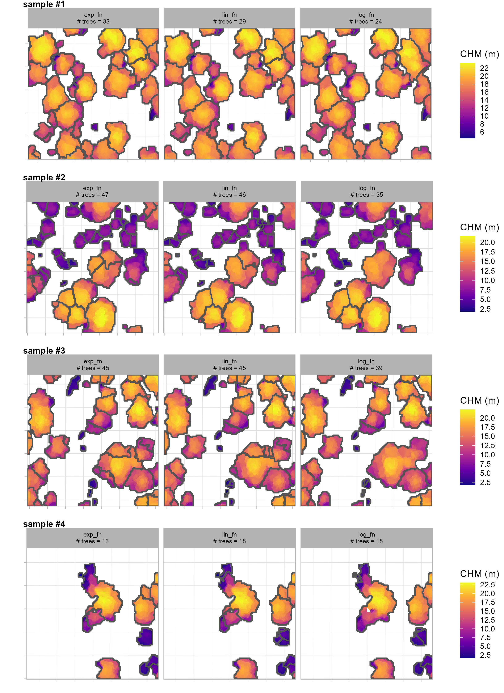
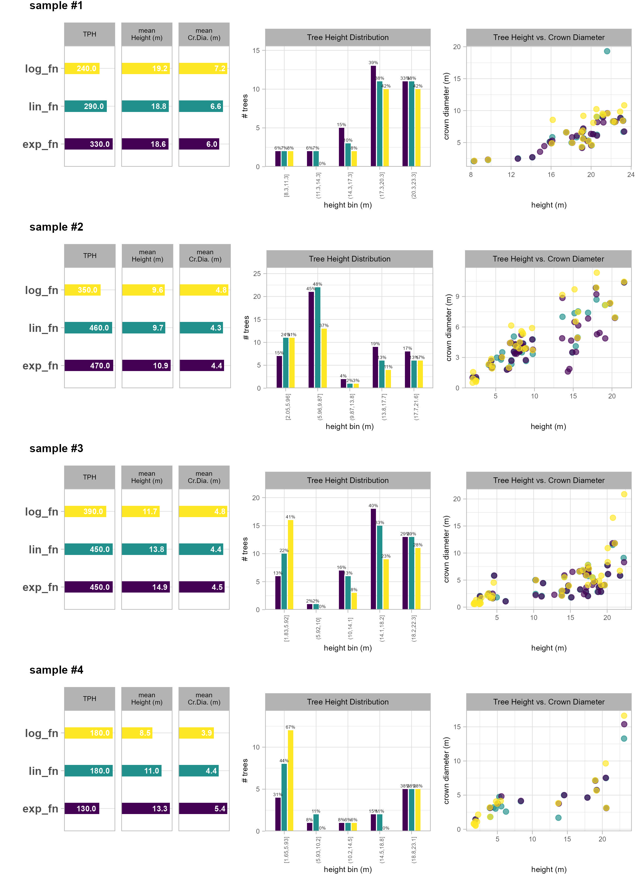
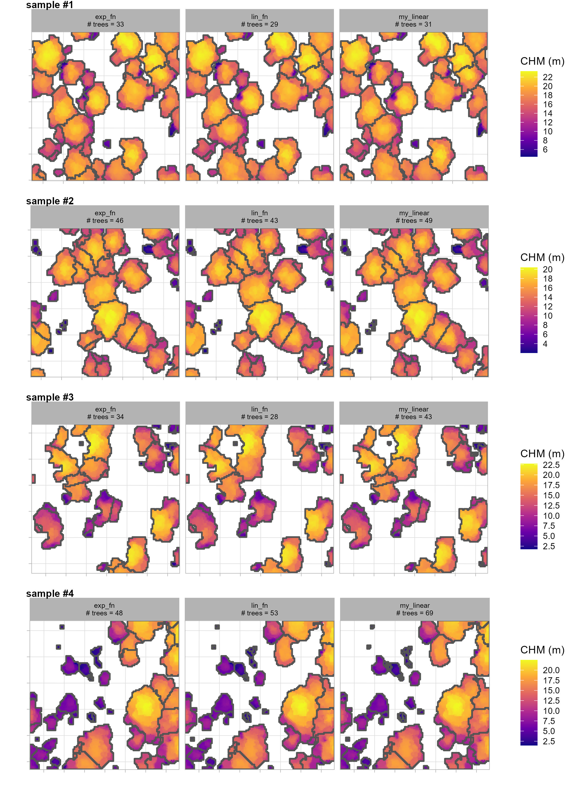

# Case Study 2: ICO Thinning Prescription

use raw point clouds to generate a spatial tree list inventory for use implementing the Individuals, Clumps, and Openings (ICO) method defined by Churchill et al. ([2016](https://scholarworks.umt.edu/ico/3)) to generate a cut-retention prescription. The `trees2ico` [package and workflow](https://github.com/georgewoolsey/trees2ico/tree/main) determines which trees to 'cut' or 'keep' based on stand-level targets for basal area and specific clump size proportions.

## Data

point cloud data was created using digital aerial photogrammetry (DAP) methods (specifically, structure-from-motion) on imagery collected from Unmanned Aircraft System (UAS) flights completed in June 2024. UAS imagery was collected using a DJI Phantom 4 Pro equipped with a 20 megapixel metal oxide semiconductor red-green-blue camera at a fixed 8.8 mm focal length. Flights followed a pre-programmed serpentine flight paths at an altitude of 120 m above ground level, using a nadir camera orientation, with 80% forward and side image overlap.The UAS imagery was processed in Agisoft Metashape using the routine outlined by Tinkham and Swayze ([2021](https://doi.org/10.3390/f12020250)).

## Point Cloud Processing

In this section we'll process the raw point cloud data using the [`cloud2trees` R package](https://github.com/georgewoolsey/cloud2trees) developed to provide accessible routines for processing point cloud data collected by airborne lidar or generated using UAS imagery and photogrammetry (e.g. structure from motion).

The `cloud2trees` package can be installed by following the directions listed in the [README file on GitHub](https://github.com/georgewoolsey/cloud2trees). If one is still experiencing difficulties installing the package, see the [setup guide](https://georgewoolsey.github.io/cloud2trees/articles/cloud2trees-setup.html) which details how to install the package using a virgin R instance.

```{r, eval=FALSE}
## remotes helps us get packages hosted on github
install.packages("remotes")
## get cloud2trees
remotes::install_github(repo = "georgewoolsey/cloud2trees", upgrade = F)
```

Load the standard libraries we use to do work

```{r, warning=FALSE, message=FALSE}
# bread-and-butter
library(tidyverse) # the tidyverse
library(viridis) # viridis colors
library(harrypotter) # hp colors
library(RColorBrewer) # brewer colors
library(scales) # work with number and plot scales
library(latex2exp)

# visualization
library(mapview) # interactive html maps
library(kableExtra) # tables
library(patchwork) # combine plots

# spatial analysis
library(terra) # raster
library(sf) # simple features
library(lidR) # lidar data
library(cloud2trees) # the cloud2trees
```

```{r, include=F, warning=F, message=F}
#########################
#   ```{r,eval=F
#########################

# knit options
knitr::opts_chunk$set(
  echo = TRUE
  , warning = FALSE
  , message = FALSE
  # , results = 'hide'
  , fig.width = 10.5
  , fig.height = 7
)
# option to put satellite imagery as base layer of mapview maps
  mapview::mapviewOptions(
    homebutton = FALSE
    # , basemaps = c("Esri.WorldImagery","OpenStreetMap")
    , basemaps = c("OpenStreetMap", "Esri.WorldImagery")
  )
```

```{r, warning=FALSE, message=FALSE, echo=FALSE, include=FALSE}
remove(list = ls()[grep("_temp",ls())])
gc()
```

### Lidar Data Location

Let's check out the lidar data we got from the Mogollon Rim area of the Coconino National Forest about 20 km north of Payson, Arizona, USA using the [USGS LidarExplorer](https://www.usgs.gov/tools/lidarexplorer).

```{r}
# directory with the downloaded .las|.laz files
f <- "f:\\UAS_Collections\\ManitouEF_202406\\Processed\\N1"
# is there data?
list.files(f, pattern = ".*\\.(laz|las)$") %>% length()
# what files are in here?
list.files(f, pattern = ".*\\.(laz|las)$")
```

what information does `lidR` read from the catalog?

```{r}
ctg_temp <- lidR::readLAScatalog(f)
ctg_temp
```

that's a lot of points...can an ordinary laptop handle it? we'll find out.

We'll plot our point cloud data tiles real quick to orient ourselves

```{r}
ctg_temp %>% 
  purrr::pluck("data") %>% 
  mapview::mapview(popup = F, layer.name = "point cloud tile")
```

### Individial Tree Detection Tuning: `itd_tuning()`

The `cloud2trees` package performs individual tree detection using `lidR::locate_trees()` with the `lidR::lmf()` algorithm. The local maximum filter algorithm allows for a constant window size or a variable window size defined by a function. See the `lidR` [package book section](https://r-lidar.github.io/lidRbook/itd.html) by point cloud processing expert [Jean-Romain Roussel](https://github.com/Jean-Romain) for excellent detail on ITD and defining window size.

The `itd_tuning()` function is used to visually assess tree crown delineation results from different window size functions used for the detection of individual trees. `itd_tuning()` allows users to test different window size functions on a sample of data to determine which function is most suitable for the area being analyzed. The preferred function can then be used in the `ws` parameter in `raster2trees()` and `cloud2trees()`.

Let's run `itd_tuning()` on our data starting with default window size functions

```{r, include=TRUE, eval=FALSE}
itd_tuning_ans <- 
  cloud2trees::itd_tuning(
    input_las_dir = f
    , n_samples = 4
    , min_height = 1.37
    , chm_res_m = 0.25
  )
```

```{r,eval=F, include=F, echo=F}
itd_tuning_ans <- 
  cloud2trees::itd_tuning(
    input_las_dir = f
    , n_samples = 1
    , min_height = 2
    , chm_res_m = 0.25
  )
```

what does `cloud2trees::itd_tuning()` give us?

```{r,eval=F}
names(itd_tuning_ans)
```

it's a named list. let's check out the `plot_*` results

```{r, include=T, eval = FALSE}
itd_tuning_ans$plot_samples
# write the file to the disk for posterity
ggplot2::ggsave(filename = "../data/itd_tuning_plot_samples1.jpg", height = 11, width = 8, dpi = "print")
```

```{r, echo=FALSE, out.width="80%", out.height="80%", fig.align='center', fig.show='hold',results='asis'}

```

the most noticeable difference between the window functions is with the segmentation of tall areas of the CHM using the `log_fn` compared to the other two. this function appears to not be separating tall trees appropriately: it is under-segmenting these areas resulting in too few tall trees. this under-segmentation by the `log_fn` can be seen most clearly in the top-right tall tree group of sample 1

comparing the `lin_fn` (linear function) and `exp_fn` (exponential function) shows that both functions result in similar segmentation results for taller trees but the primary differences appear for shorter trees. The difference in short-tree segmentation between these two functions is most evident in sample 2 where the `lin_fn` predicts many more small trees than the `exp_fn`.

let's check out the resulting tree distribution of the different window functions over these sample areas

```{r, include=T, eval = FALSE}
itd_tuning_ans$plot_sample_summary
# write the file to the disk for posterity
ggplot2::ggsave(filename = "../data/itd_tuning_plot_sample_summary1.jpg", height = 11, width = 8, dpi = "print")
```

```{r, echo=FALSE, out.width="80%", out.height="80%", fig.align='center', fig.show='hold',results='asis'}

```

these results confirm what we identified about the `log_fn` compared to the other two: that it under-segments taller trees. predicting too few tall trees by not separating multiple tree crowns has the effect of producing tall trees with very wide crowns.

let's look at the default window function named `lin_fn` (i.e. linear function) from `cloud2trees` to see how we might adjust it to obtain different tree segmentation results

```{r,eval=F}
itd_tuning_ans$ws_fn_list$lin_fn
```

it's a function defining the window size (called `y`) based on the CHM height (called `x`)

let's make a custom linear function that limits the search window for shorter trees but keeps roughly the same window size for taller trees between 15-25 m (we don't expect many trees above this in our study area)

```{r}
# define a custom function
my_linear <- function(x){
    y <- dplyr::case_when(
      is.na(x) ~ 0.001
      , x < 0.01 ~ 0.001
      # next piece:
        # we want it to pass through ~ (3.0,1.00)
        # m = (y2-y1)/(x2-x1) >> m = (1.00-0.001)/(3.0-0.01) = 0.3341137
        # b = y-(m*x) >> b = 0.001-(0.3341137*0.01) = -0.002341137
      , x < 3.0 ~ -0.002341137 + x*0.3341137
      # next piece:
        # at x=3.0, first segment y = -0.002341137+3.0*0.3341137 = 1.00 >> (3.0,1.00)
        # connect to (32.5,5)
        # m = (5-1.00)/(32.5-3.0) = 0.1355932
        # b = 1.00-(0.1355932*3.0) = 0.5932204
      , x <= 32.5 ~ 0.5932204 + x*0.1355932 
      # upper limit starts at (32.5,5)
      , x > 32.5 ~ 5
    )
    return(y)
}
# my_linear
```

we can plot the two default functions that we did not rule out based on the first set of `cloud2trees::itd_tuning()` samples along with our custom linear function

```{r,eval=F}
# plot the ws fn
ggplot2::ggplot() +
  ggplot2::geom_function(fun = itd_tuning_ans$ws_fn_list$lin_fn, aes(color = "lin_fn"), lwd = 1) +
  ggplot2::geom_function(fun = itd_tuning_ans$ws_fn_list$exp_fn, aes(color = "exp_fn"), lwd = 1) +
  ggplot2::geom_function(fun = my_linear, aes(color = "my_linear"), lwd = 1) +
  ggplot2::xlim(-5,42) +
  ggplot2::labs(x = "heights", y = "ws", color = "") +
  ggplot2::theme_light()
```

nice, we should get more small trees and split the difference between the two default functions since we felt pretty good about the segmentation for the taller trees

re-run tuning with new function

```{r, include=TRUE, eval=FALSE}
# let's put these in a list to test with the best default function we saved from above
my_fn_list <- list(
  lin_fn = cloud2trees::itd_ws_functions()[["lin_fn"]]
  , exp_fn = cloud2trees::itd_ws_functions()[["exp_fn"]]
  , my_linear = my_linear
)
itd_tuning_ans2 <- 
  cloud2trees::itd_tuning(
    input_las_dir = f
    , ws_fn_list = my_fn_list
    , n_samples = 4
    , min_height = 1.37
    , chm_res_m = 0.25
  )
```

let's check out the `plot_*` results

```{r, include=T, eval = FALSE}
itd_tuning_ans2$plot_samples
# write the file to the disk for posterity
ggplot2::ggsave(filename = "../data/itd_tuning_plot_samples2.jpg", height = 11, width = 8, dpi = "print")
```

```{r, echo=FALSE, out.width="80%", out.height="80%", fig.align='center', fig.show='hold',results='asis'}

```

Our custom `my_linear` function appears to do a good job striking a balance between the default `lin_fn` which tended to undersegment taller trees an the `exp_fn` which tended to undersegment shorter trees. The custom function and the `exp_fn` yield similar tree segmentation results for sample 1 which is what we expected since that area consists primarily of taller trees and the biggest change we made to `my_linear` function was to limit the search window at the taller range and expand the search window for shorter trees so that less were detected compared to the default `lin_fn`. One notable difference with the `exp_fn` (exponential function) in sample 1 is in the lower left corner where the custom function limited crown sprawl for one of the taller objects in the scene an yielded more realistic crown shapes. Our custom `my_linear` function yields fewer small trees than the default `lin_fn` (but more than the `exp_fn`) since we allowed a larger window size at lower portions of the CHM with this effect most clear for the short trees (purple CHM regions) on sample 2.

we like the results with our custom linear function which we'll use in the `cloud2trees()` function.

```{r, warning=FALSE, message=FALSE, echo=FALSE, include=FALSE}
remove(list = ls()[grep("_temp",ls())])
remove(itd_tuning_ans, itd_tuning_ans2,crowns_simplified,plt_rgb_rast_itd_crowns)
gc()
```

### Point Cloud Tree Extraction: `cloud2trees()`{#trees}

The `cloud2trees()` function combines methods in the `cloud2trees` package for an all-in-one approach. We'll call this function estimating the additional tree components (the `estimate_*` parameters):

* `accuracy_level = 2` - uses triangulation with high point density (20 pts/m2) to height normalize the points
* `keep_intrmdt = T` - keeps intermediate files created in the processing (e.g. height-normalized points)
* `dtm_res_m = 0.5` - sets the output DTM resolution to 0.5x0.5 m
* `chm_res_m = 0.25` - sets the output CHM resolution to 0.25x0.25 m which is also used for tree detection
* `min_height = 1.37` - the minimum height of a predicted segment that is required to be kept as a detected "tree"
* `ws = my_linear` - the window function used in ITD
* `estimate_tree_dbh = TRUE` - estimates DBH based on tree height
* `estimate_tree_type = TRUE` - estimates FIA forest type group for the tree list

```{r, warning=F, results=F}
# outdir
c2t_output_dir <- "../data/processed_uas"
if(!dir.exists(c2t_output_dir)) dir.create(c2t_output_dir)
c2t_process_dir <- file.path(c2t_output_dir, "point_cloud_processing_delivery")
##############################################################
# cloud2trees::cloud2trees
##############################################################
if(
  !file.exists( file.path(c2t_process_dir, "chm_0.25m.tif") )
  || !file.exists( file.path(c2t_process_dir, "dtm_0.5m.tif") )
  || !file.exists( file.path(c2t_process_dir, "final_detected_tree_tops.gpkg") )
  || !file.exists( file.path(c2t_process_dir, "final_detected_crowns.gpkg") )
){
  # run it
  # cloud2trees
  cloud2trees_ans <- cloud2trees::cloud2trees(
    output_dir = c2t_output_dir
    , input_las_dir = f
    , accuracy_level = 2
    , keep_intrmdt = T
    , dtm_res_m = 0.5
    , chm_res_m = 0.25
    , min_height = 1.37 # 1.37 = DBH
    , ws = my_linear # a custom function
    ###################################
    # optional parameters to get more tree attributes
    ###################################
    , estimate_tree_dbh = TRUE # DBH
    , estimate_tree_type = TRUE # FIA type
  )
  
}else{
  dtm_temp <- terra::rast( file.path(c2t_process_dir, "dtm_0.5m.tif") )
  chm_temp <- terra::rast( file.path(c2t_process_dir, "chm_0.25m.tif") )
  crowns_temp <- sf::st_read(file.path(c2t_process_dir, "final_detected_crowns.gpkg"), quiet = T)
  ttops_temp <- sf::st_read(file.path(c2t_process_dir, "final_detected_tree_tops.gpkg"), quiet = T)
  
  cloud2trees_ans <- list(
    "dtm_rast" = dtm_temp
    , "chm_rast" = chm_temp
    , "crowns_sf" = crowns_temp
    , "treetops_sf" = ttops_temp
  )
}
```

```{r, warning=FALSE, message=FALSE, echo=FALSE, include=FALSE}
# cloud2trees:::search_dir_final_detected(c2t_process_dir)
remove(list = ls()[grep("_temp",ls())])
gc()
```

#### Raster Products

there's a DTM

```{r}
# plot to check out the fine-resolution DTM raster
cloud2trees_ans$dtm_rast %>% terra::plot(main = "DTM (m)")
```

there’s a CHM

```{r}
# plot to check out the fine-resolution CHM raster
cloud2trees_ans$chm_rast %>% 
  terra::plot(col = viridis::plasma(n=100), main = "CHM (m)")
```

let's see some details about the CHM

```{r}
# what chm?
cloud2trees_ans$chm_rast
```

#### Tree list

let's check out the tree top point data (the crowns data will have the same data attributes but have polygon geometry instead of point geometry)

```{r}
cloud2trees_ans$treetops_sf %>% 
  dplyr::glimpse()
```

note, we only really need tree location and DBH to implement the ICO method, so we were able to save on processing time by not extracting CBH or HMD. If we were interested in utilizing those tree-level metrics for additional analysis or planning beyond implemeting the ICO method, then we would need to enable those options in `cloud2trees()`

let's check the relationship between height and DBH as estimated by the regional allometric relationship

```{r}
cloud2trees_ans$treetops_sf %>% 
  sf::st_drop_geometry() %>% 
  dplyr::slice_sample(prop = 0.55) %>% 
  ggplot2::ggplot(mapping = ggplot2::aes(x = tree_height_m, y = dbh_cm)) + 
  ggplot2::geom_point(color = "navy", alpha = 0.6) +
  ggplot2::labs(x = "tree ht. (m)", y = "tree DBH (cm)") +
  ggplot2::scale_x_continuous(limits = c(0,NA), breaks = scales::breaks_extended(n=8)) +
  ggplot2::scale_y_continuous(limits = c(0,NA), breaks = scales::breaks_extended(n=8)) +
  ggplot2::theme_light()
```

Let's look at the distribution of tree diameter in our study area

```{r}
cloud2trees_ans$treetops_sf %>% 
  sf::st_drop_geometry() %>% 
  ggplot2::ggplot(mapping = ggplot2::aes(x = dbh_cm)) +
  ggplot2::geom_density(fill = "brown", color = "brown", alpha = 0.2) +
  ggplot2::scale_x_continuous(breaks = scales::breaks_extended(11)) +
  ggplot2::labs(x = "tree DBH (cm)", y = "") +
  ggplot2::theme_light() +
  ggplot2::theme(axis.text.y = ggplot2::element_blank(), axis.ticks.y = ggplot2::element_blank())
```

let's look at the summary statistics of DBH and height

```{r}
cloud2trees_ans$treetops_sf %>% 
  sf::st_drop_geometry() %>% 
  dplyr::select(dbh_cm,tree_height_m) %>% 
  summary()
```

lots of small trees. what if we only count trees that are at least 2 m in height?

```{r}
cloud2trees_ans$treetops_sf %>% 
  sf::st_drop_geometry() %>% 
  dplyr::filter(tree_height_m>=2) %>% 
  ggplot2::ggplot(mapping = ggplot2::aes(x = dbh_cm)) +
  ggplot2::geom_density(fill = "brown", color = "brown", alpha = 0.2) +
  ggplot2::scale_x_continuous(breaks = scales::breaks_extended(11)) +
  ggplot2::labs(x = "tree DBH (cm)", y = "") +
  ggplot2::theme_light() +
  ggplot2::theme(axis.text.y = ggplot2::element_blank(), axis.ticks.y = ggplot2::element_blank())
```

a two-aged stand

#### Processing Time

The `cloud2trees()` function dropped off a lot of additional data in a folder titled "point_cloud_processing_delivery" which is nested where we told the command to write the data (`output_dir = "../data"` parameter setting). Let's load in the "processed_tracking_data.csv" file to see how long that `cloud2trees()` process took to run. Run times are, of course, dependent on computer processing and I am working on a laptop typical of a spatial analyst (especially outside of the US Federal Government) running Windows with an Intel i7-10750H 6-core computer processor unit and 32 gigabytes of random-access memory.

```{r}
timer_df <-
  c2t_output_dir %>% 
  file.path("point_cloud_processing_delivery", "processed_tracking_data.csv") %>% 
  readr::read_csv(show_col_types = F, progress = F) %>% 
  dplyr::mutate(
    timer_total_time_mins = timer_cloud2raster_mins + timer_raster2trees_mins +
      timer_trees_dbh_mins + 
      # timer_trees_cbh_mins + 
      timer_trees_type_mins
      # timer_trees_hmd_mins + 
      # timer_trees_biomass_mins
    , timer_tree_extraction_mins = timer_cloud2raster_mins + timer_raster2trees_mins
    , points_per_m2 = number_of_points/las_area_m2
    , timer_total_time_mins_per_ha = timer_total_time_mins/(las_area_m2/10000)
  ) %>% 
  dplyr::select(
    -c(timer_trees_cbh_mins,timer_trees_hmd_mins, timer_trees_biomass_mins)
  ) %>% 
  dplyr::mutate(
    dplyr::across(
     .cols = c(timer_tree_extraction_mins,
      timer_trees_dbh_mins
      # , timer_trees_cbh_mins
      , timer_trees_type_mins
      # , timer_trees_hmd_mins
      # , timer_trees_biomass_mins
    )
     , .fns = ~ .x/timer_total_time_mins
     , .names = "{.col}_pct"
    )
    , dplyr::across(
     .cols = c(timer_tree_extraction_mins,
      timer_trees_dbh_mins
      # , timer_trees_cbh_mins
      , timer_trees_type_mins
      # , timer_trees_hmd_mins
      # , timer_trees_biomass_mins
    )
     , .fns = ~ paste0(scales::comma( (.x/(las_area_m2/10000)),accuracy=0.001), "<br>(", scales::percent( (.x/timer_total_time_mins), accuracy = 0.1 ), ")")
     , .names = "{.col}_full_lab"
    )
  )
  
# timer_df %>% dplyr::glimpse()
```

table the processing stats

```{r}
timer_df %>% 
  dplyr::select(
    number_of_points
    , points_per_m2
    # timer
    , timer_total_time_mins_per_ha
    , tidyselect::ends_with("_full_lab")
      # , timer_tree_extraction_mins,
      #   timer_trees_dbh_mins, timer_trees_cbh_mins, timer_trees_type_mins,
      #   timer_trees_hmd_mins, timer_trees_biomass_mins
  ) %>% 
  dplyr::mutate(
    desc = "UAS-DAP data"
    , number_of_points = scales::comma((number_of_points/1000000),accuracy=0.1,suffix = " M")
    , timer_total_time_mins_per_ha = scales::comma(timer_total_time_mins_per_ha,accuracy=0.001)
    , dplyr::across(tidyselect::ends_with("_per_m2"), ~scales::comma(.x,accuracy = 1))
  ) %>%
  dplyr::relocate(desc) %>% 
  # ncol()
  # dplyr::glimpse()
  kableExtra::kbl(
    caption = "Data Processing Summary"
    , col.names = c(
      "."
      # data desc
      , "# points", "points m<sup>-2</sup>"
      # timer
      , "TOTAL"
      , "tree<br/>extraction", "DBH", "forest<br/>type"
    )
    , escape = F
    # , digits = 2
  ) %>% 
  kableExtra::kable_styling(font_size = 11) %>% 
  kableExtra::add_header_above(
    c(
      " "=1
      , "Input Data<br/>Description" = 2
      , "Processing Time<br/>minutes ha<sup>-1</sup>" = 4
    )
    , escape = F
  ) %>% 
  kableExtra::column_spec(c(1,3,7), border_right = TRUE, include_thead = TRUE) %>% 
  kableExtra::collapse_rows(columns = 1, valign = "top")
```

let's just use the extracted tree top spatial points since this is all we need for the ICO process

```{r}
treetops_sf <- cloud2trees_ans$treetops_sf
```

```{r, warning=FALSE, message=FALSE, echo=FALSE, include=FALSE}
remove(list = ls()[grep("_temp",ls())])
remove(my_linear, itd_tuning_ans, timer_df, cloud2trees_ans)
gc()
```

